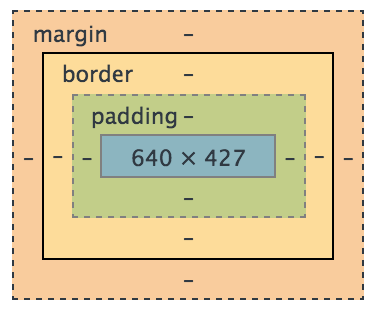

<section>
        
We’ve all heard it. "I want my site to look good." Or - "We must have the best designed site to stand out." I can’t even tell you how many times I’ve heard "can you fix the padding?" Its always some phrase to stress the importance of good design. Well, what exactly is good design? Does it really matter?

        
Uh, yes. In my <i>humble</i> opinion, design is the bread and butter of any website. In a plethora of web sites and apps, this is the only key that separates good from great. Obviously UX/UI, and so much more will go into design, but lets focus on the developer’s involvement of web design.

        
Do you remember being in school and learning how to write? I sure do. The unrelenting hours and hand cramps of understanding that writing in a straight line was important. But more so than that, SPACING mattered. Indenting, line spacing/letter spacing and more all played an important role to writing. Though these things may not longer be used (I mean, who hand writes anything anymore?), they are ironically just as important to web design.

        
So, lets focus on what spacing is in CSS, and what each type does. Sounds good? Well I’m going to anyway.

        

        

        <h2>Borders.</h2>

        
The border is of course the line that goes around an element - like the U.S. border. It outlines whatever element we are targeting.

        
In CSS, borders allow you be specific about size and designs of the outline of an element.

        
So lets say you just purchased some land. Lets be more specific, you purchased a lot to build a house on. Well, congratulations to you, but I don't have a cookie for you. I’m sure you don't want to just leave your lot open (or at least I hope you won’t?). The right answer is no, and that you want to build a fence. Lets do just that. Lets build a fence thats white, and solid all the way around. Alright, so there you have it, you have a border around your lot thats white and solid.
 

        

         

        

        <h2>Margins.</h2>

        
In CSS, a margin pushes space around your element.

        
        <label>Courtesy of W3.</label>

        
Lets say that you finally built a house on that lot of yours. Everything about it is great, except for one thing. Your lot is too close to your neighbors. Wouldn’t it be awesome if you could just clear some space and push your neighbors lot away? Although it would solve some real space issues, it would probably make your neighbor pretty upset.

        
CSS margins allow you to do just that: create some space between an item, and its neighboring element. Margins will often push out from top, bottom, left, or right from any element on the page.

        

        
Though you might think that margins alone fix all problems, they in fact don’t.

        

        <h2>Padding.</h2>

        
Like margins, padding will push an area around content, but inside of a border. 

        
Sticking to the house examples, lets say its time to put up some trees. We cant exactly put trees right next to the fence can we? I mean we could, but it might look weird being so close against your neighbors lot (and he would probably be even more mad because you already pushed his house away). In this situation, you don't need to push out from your lot to plan them right? Rather, you want to plant them a few feet away from your gate within your own lot.
 

        
CSS Paddings allow you to pad an element within a border. So, the border is the fencing around your house, and padding in 10 feet means you would plant all your trees that will surround your house 10 feet INTO your lot from the fence.
 

        
I probably don't make any sense, so heres a picture I hope you’ll understand.

        

        
Though minute, these simple concepts are crucial in the spacing of elements on a website. So, you want that site that looks amazing? Well, padding isn't everything, but I’ve come to understand its what people care about with good design, and you should do.

    </section>